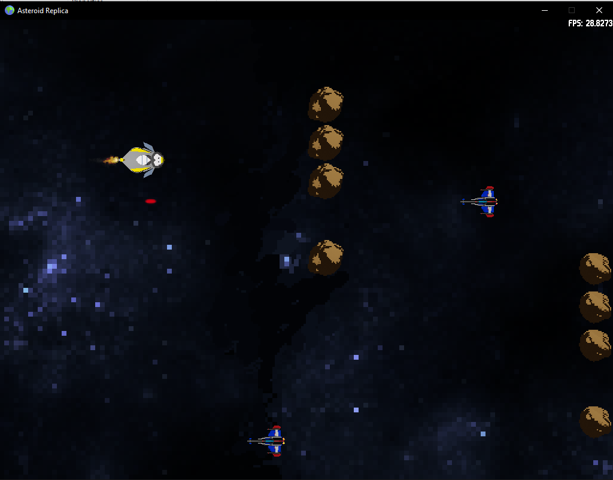

# Asteroid-Replica
Not really an asteroid game, more like a scrolling 2D shooter, a basic project for learning C++ and SDL 2.0 purpose.



I followed this tutorial: [Lazyfoo SDL Tutorials](http://lazyfoo.net/tutorials/SDL/index.php)

* All art content is created in Krita & Blender
* Audio is generated and downloaded from
    * [Wolfram Tones](http://tones.wolfram.com/generate/GrmLie0HpWYCg0twN2SLO3FBIv9EEjCbzkaGxuMZHRXE6)
    * [Free Sound Effects](https://www.freesoundeffects.com/free-sounds/explosion-10070/)

## Build Requirement
```markdown
> SDL2
> SDL2 image
> SDL2 ttf
> SDL2 mixer
```